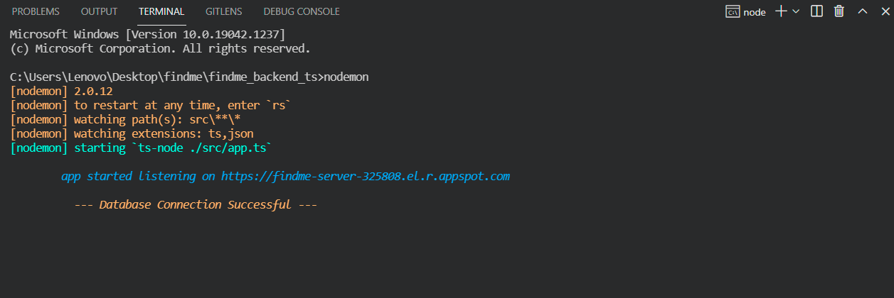

# FIND ME SERVER

This server code serves all the back-end services for  
[**FIND-ME**](https://find-me0.web.app) 
App
and is currently running on Google Cloud App Engine.



  

## Technolgy Used

**Client:** [Angular](https://angular.io/), [Ionic](https://ionicframework.com/docs/angular/overview) ,  [Socket.io Client-side](https://socket.io/docs/v4/client-api/)

**Server:** [TypeScript](https://www.typescriptlang.org/), [ Node.js](https://nodejs.org/en/docs/), [Express](https://www.npmjs.com/package/express) ,[ Socket.io Server-side](https://socket.io/docs/v4/server-api/)

  
## Deployment
 To run this project on local machine
 
```bash
  nodemon
```

To deploy this project run

```bash
  npm run deploy
```
  
## Developers

[@shivam101gaur](https://www.github.com/shivam101gaur)

  